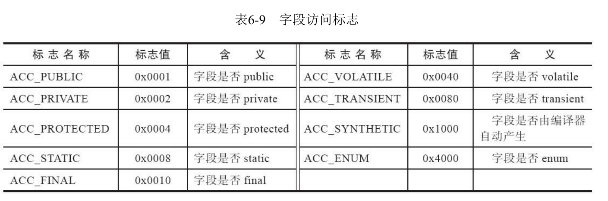
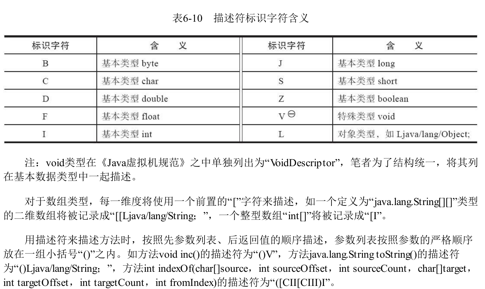

# 结构

## 文件结构说明


## 魔数和class文件的版本号


## 常量池


17种，每一种都是一个表，每种结构互不相同，开头都是一个类型标记


## 访问标志

常量池后面两个字节是访问标志，用于表示一些类或者借口层次的访问信息，包括：这个Class是类还是接口，是否是public的，是否是abstract的，如果是类的花，是否是final的，等等。


## 类索引、父类索引与接口索引

- 类索引， u2类型数据，用于确定这个类的全限定名
- 父类索引，u2类型数据，仅有一个(java不允许多继承)，用于确定这个类的父类的全限定名
- 接口索引，一组u2类型的数据的集合，用于确定这个类实现了哪些借口

## 字段表集合

字段表用于描述接口或者类中声明的变量。Java语言中的“字段”(Field)包括类级变量以及实例级变量,但不包括在方法内部声明的局部变量。


字段可以包括作用域(public,private,protected)，是实例变量还是类变量(static)，可变性(final)，并发可见性(volatile)，可否被序列化(transient)，字段数据类型(基本类型、对象、数组)，字段名称。




跟随字段访问标志后面的是：name_index和descriptor_index。他们都是对常量池项的引用，分别代表字段的**简单名称**以及**字段和方法的描述符**。

**简单名称**代表没有类型和参数修饰符的方法或者字段名称，例如，inc()方法和m字段的简单名称分别是inc和m。

**描述符**用来描述字段的数据类型、方法的参数列表（包括数量、类型和顺序）和返回值。





在描述符之后，跟随一个属性集合，如果将字段m声明为"final static int m=123",则可能会存在一个名为ConstantValue 的属性，存放常量123。


## 方法表集合

方法表结构和字段表结构大致相同。


另外，方法中的代码，存放在方法属性表集合一个名为Code的属性里面。


## 属性表集合


**最后一项类型u1，名称info,个数attribute_length没看懂什么意思，主要是u1没看懂，不是指1个字节吗？难道每个info都是一个字节？？**


### Code属性


1. attribute_name_index是一项只想CONSTANT_Utf8_info型常量的索引，此常量固定为"Code"，它代表了给属性的名称
2. attribute_length指示属性之的长度.
3. max_stack,代表操作数栈深度的最爱之。在方法执行的任意时刻，操作数栈都不会超过这个深度。虚拟机运行的时候需要根据这个值来分配栈帧的操作栈深度。
4. max_locals,代表局部变量所需的存储空间。单位是变量槽(Slot)，变量槽是虚拟机为局部变量分配内存所使用的最小单位。


5. code_length,字节码长度

6. code,用于存储字节码指令的一系列字节流，每个指令是一个u1类型的单字节，u1（0~255），所以一共可以表达256条指令，jvm已经定义了约200条

   ```
   package com.zh.clazz;
   
   public class TestClass {
       private int m;
   
       public int inc() {
           return m + 1;
       }
   }
   ```

   

如上图使用javap命令查看class文件，发现local和args_size都为1,是因为java中，实力方法是通过this关键字访问到此方法所属的对象的。实现方式就是在编译时将this关键字的访问转变为对一个普通方法参数的访问，然后在虚拟机调用实例方法时自动传入此参数。

7. 异常表

   

### Exceptions属性


