# java内存模型与线程

## 硬件的效率与一致性

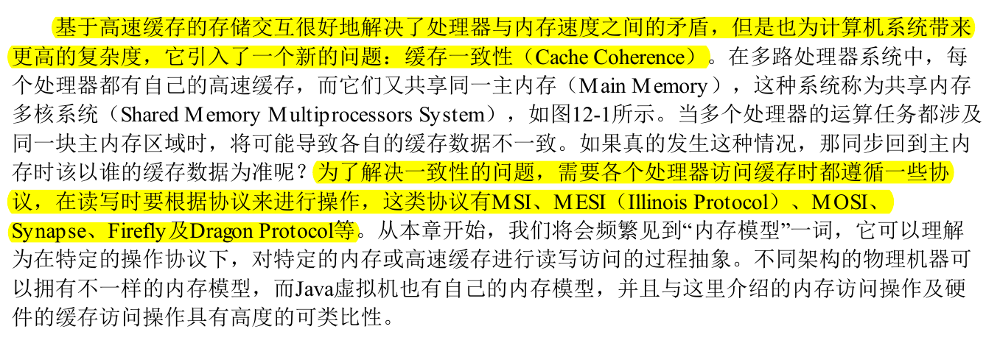

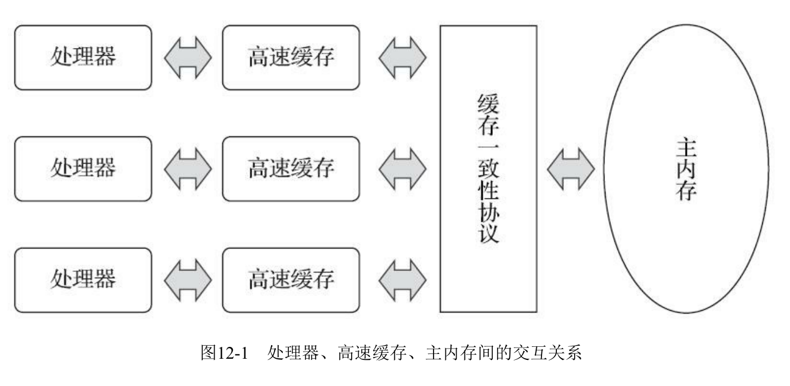

## Java内存模型

### 主内存与工作内存

Java内存模型的主要目的是定义程序中各种变量的访问规则，即关注在虚拟机中把变量值存储到内存和从内存中取出变量值这样的底层细节。

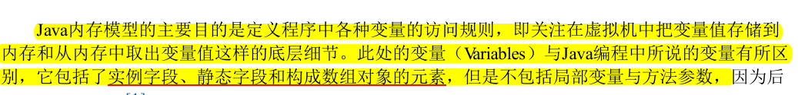

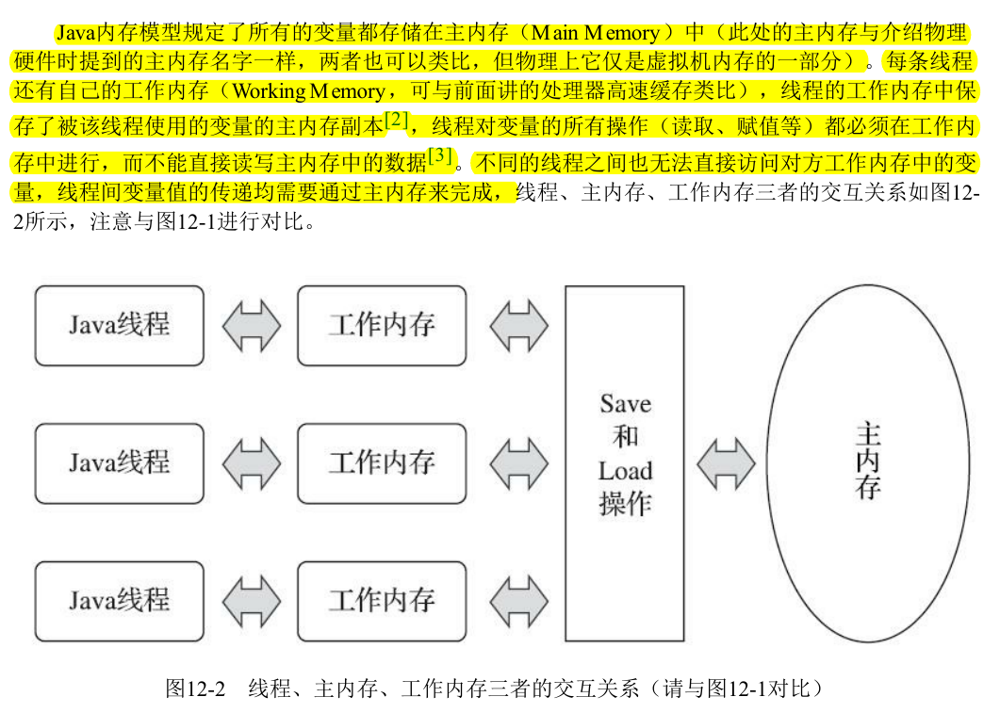

### 内存间交互操作

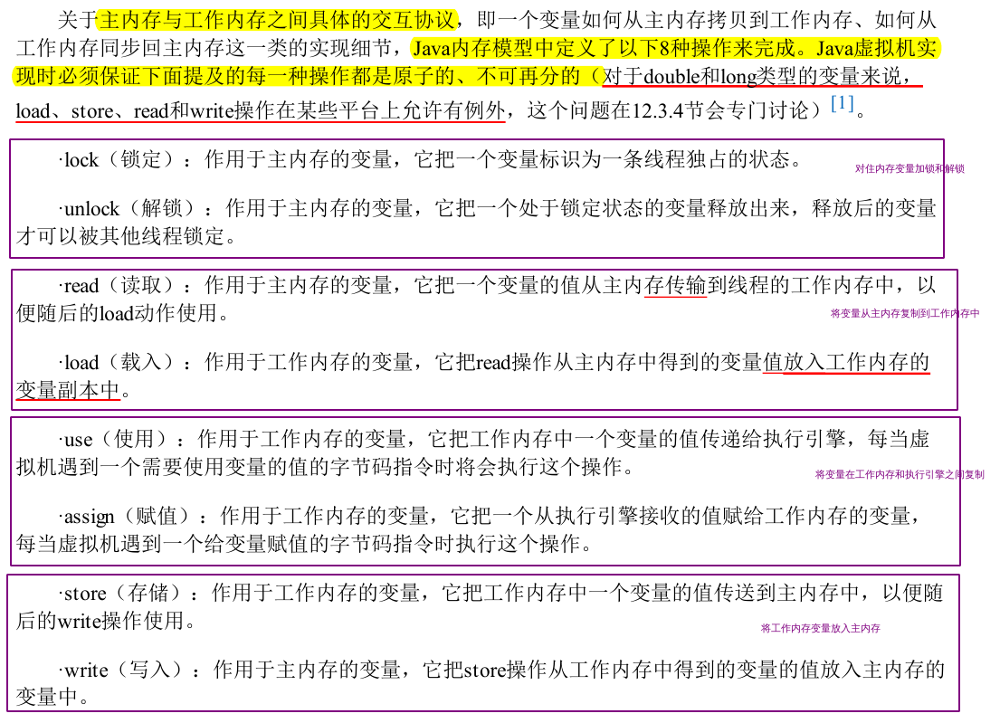

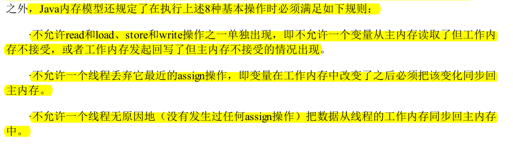

### 对于volatile型变量的特殊规则

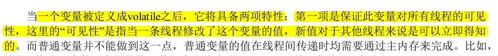

### 原子性、可见性和有序性

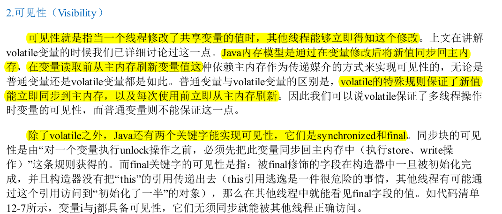

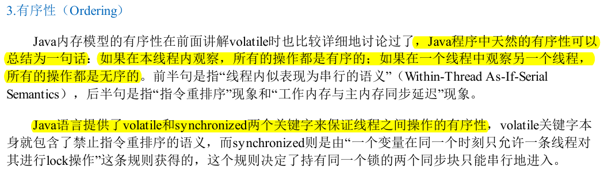

### 先行发生(Happens-Before)原则

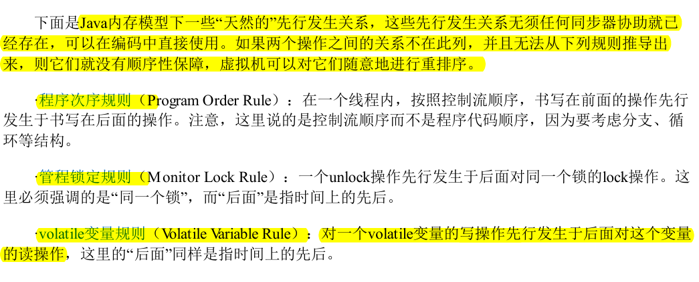

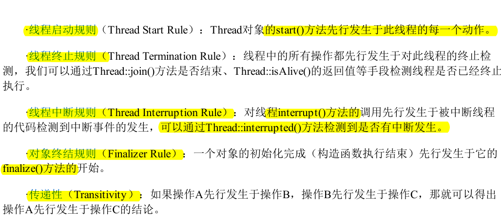

关于操作“时间上先发生”和“先行发生(Happens-Before)”的关系：

1, 时间上先发生不代表这个操作是“先行发生”的，多个线程对普通共享变量的读些

2, “先行发生”不代表这个操作是“时间上先发生”，指令会重排序，例如同一个线程中两行代码，按照程序次序规则应该是“先行发生的”，但是编译器可能会进行指令冲排序，实际执行时不一定是“时间上先发生”的。但是并不影响“先行发生”原则的正确性。

结论： 时间先后顺序与先行发生原则之间基本没有因果关系，衡量并发安全问题的时候不要受时间顺序的干扰，一切必须以先行发生原则为准。

## Java与线程

### 线程的实现

三种方式

1. 使用内核线程实现（1：1实现）
2. 使用用户线程实现（1：N实现）
3. 使用用户线程加轻量级进程混合实现（N：M实现）

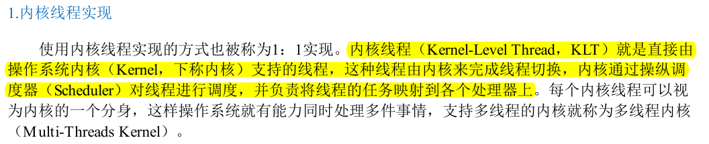

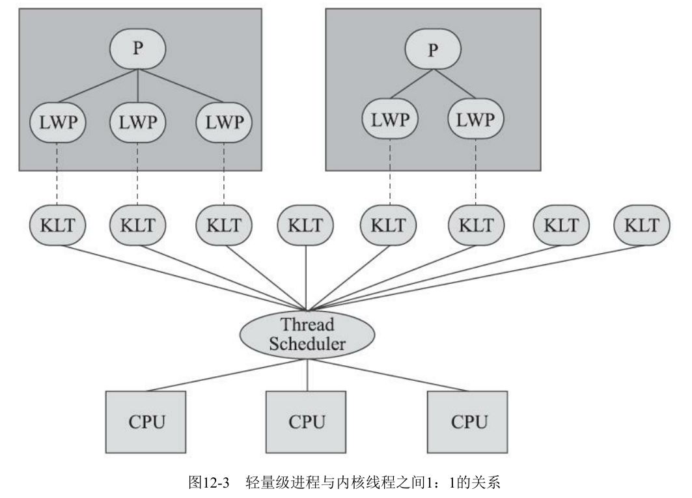

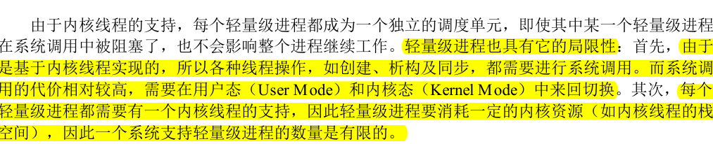

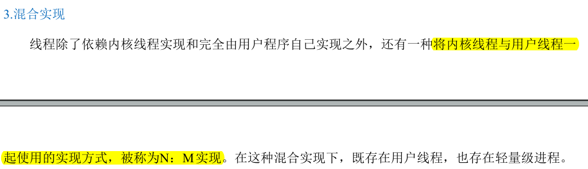

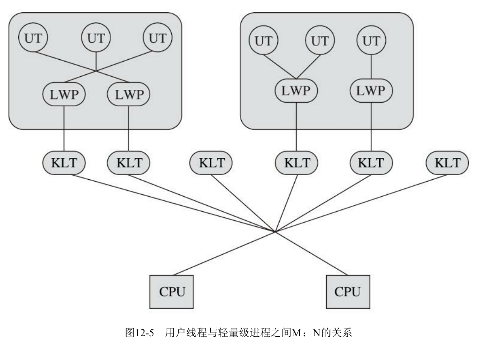

### Java线程调度

### 状态转换

java语言定义了六种线程状态，***在任意一个时间点，一个线程只能有且只有其中的一种状态，并且可以通过特定的方法在不同状态之间转换***

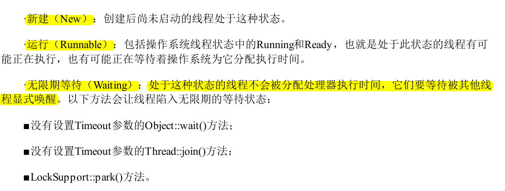

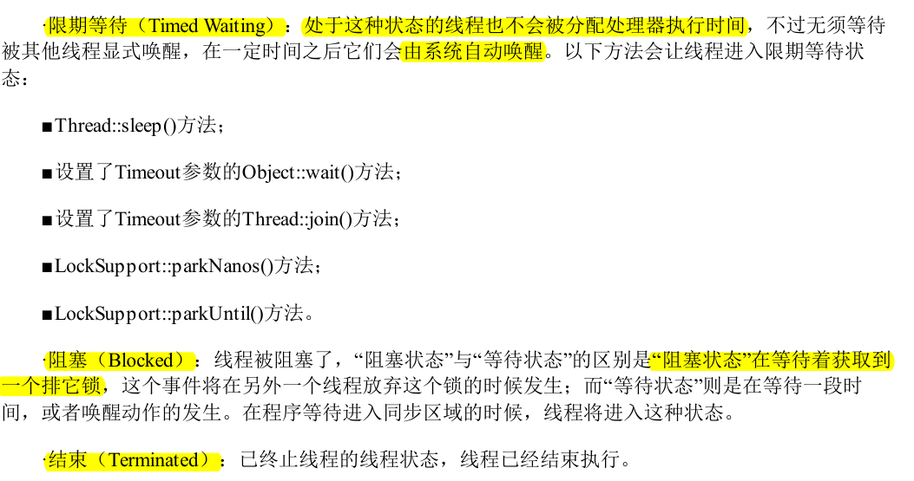

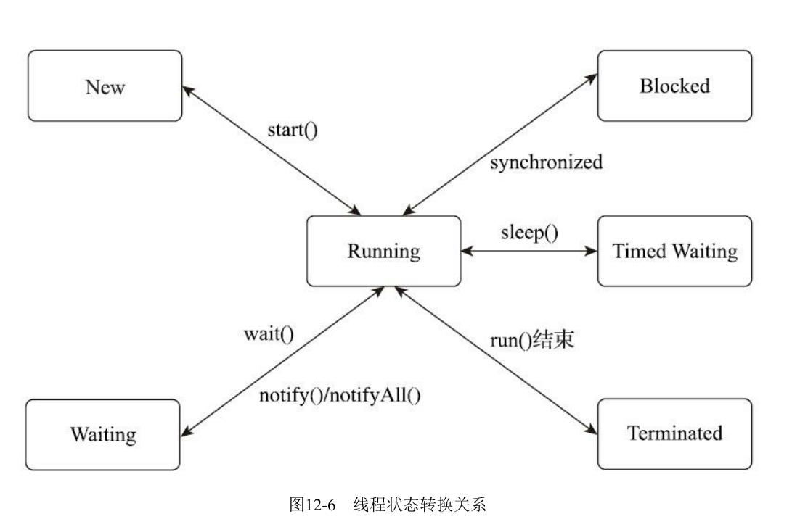

## Java与协程

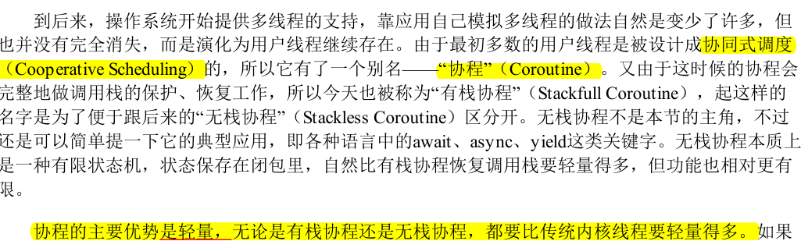

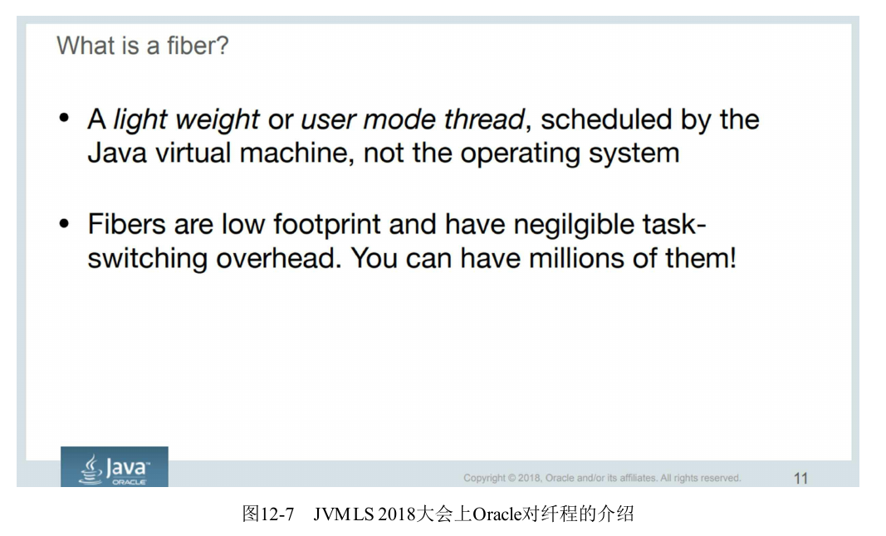

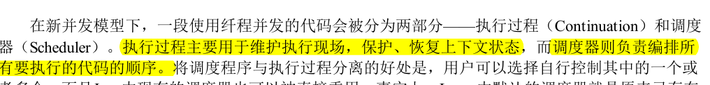