# 虚拟机字节码执行引擎

## 运行时栈帧结构

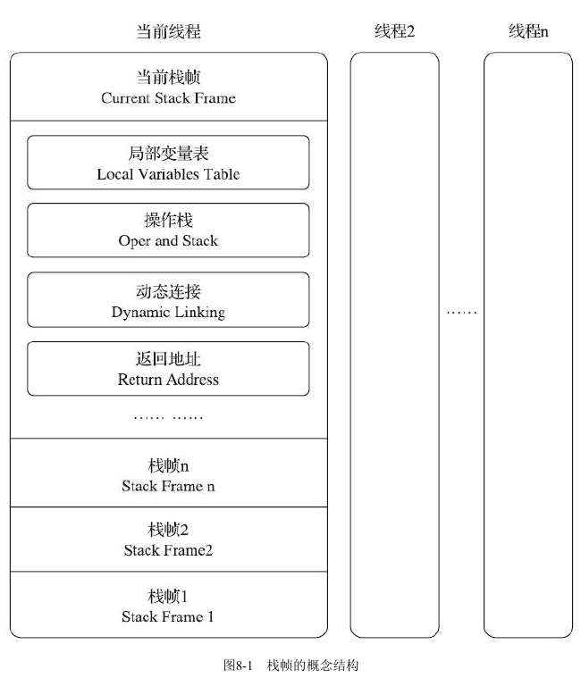

### 局部变量表

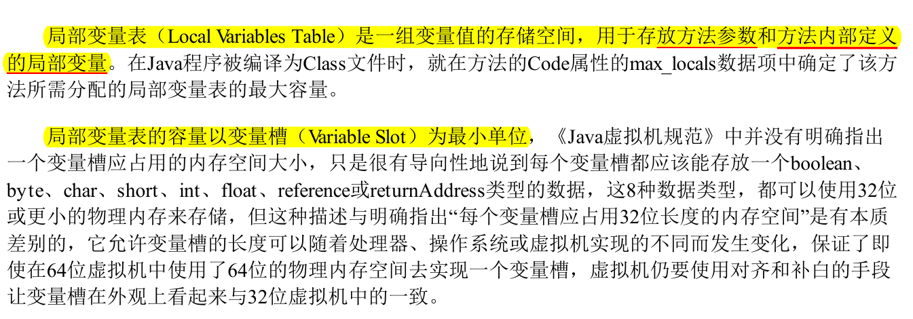

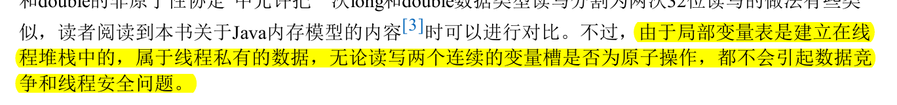

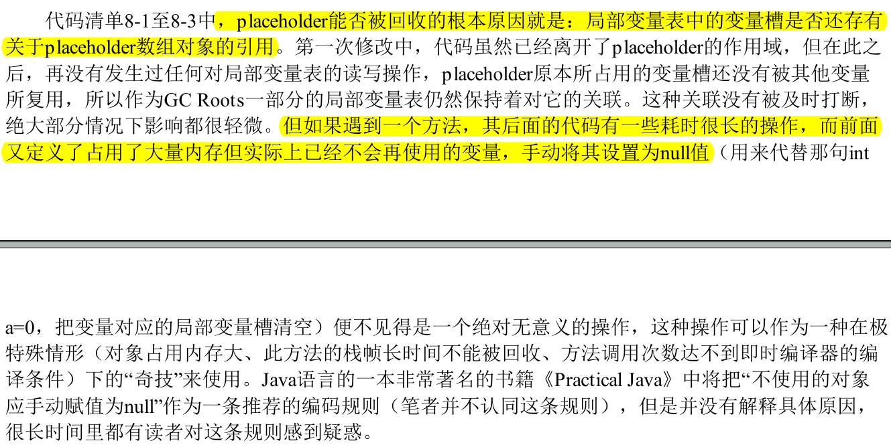

关于为什么局部变量必须赋值

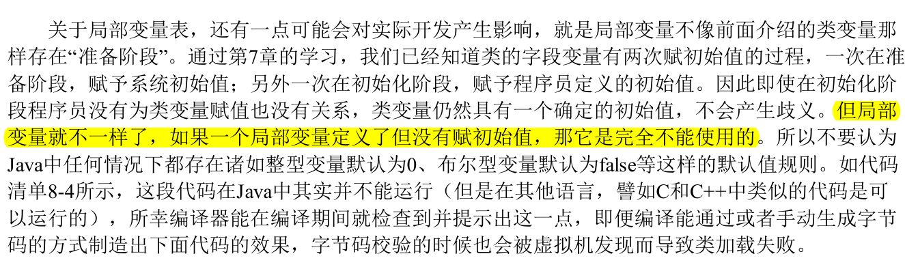

### 操作数栈

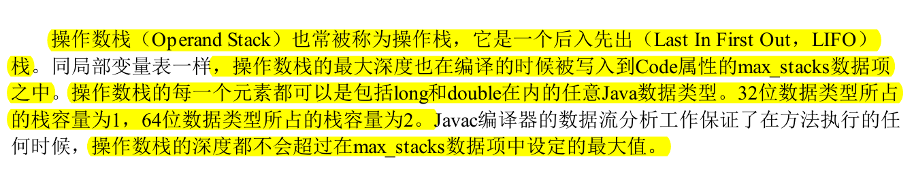

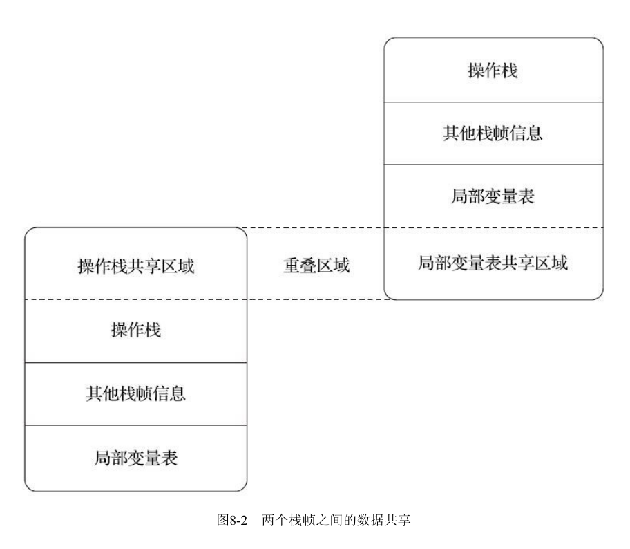

### 动态链接

### 方法返回地址

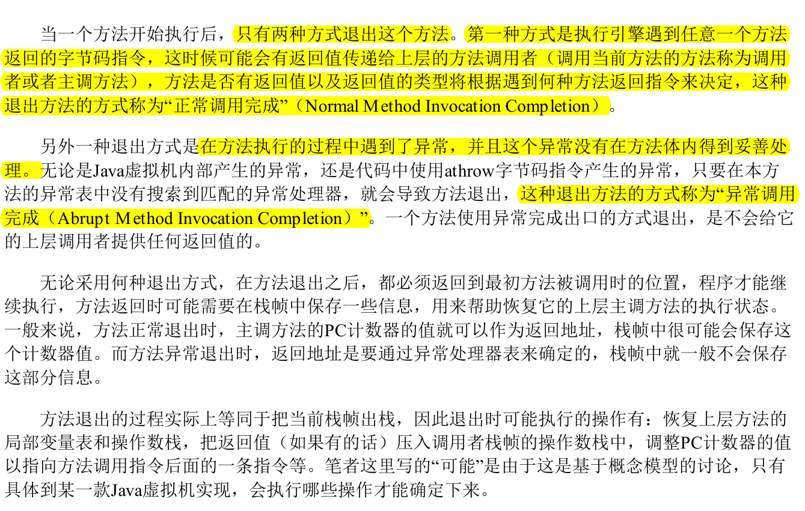

### 附加信息

## 方法调用

### 解析

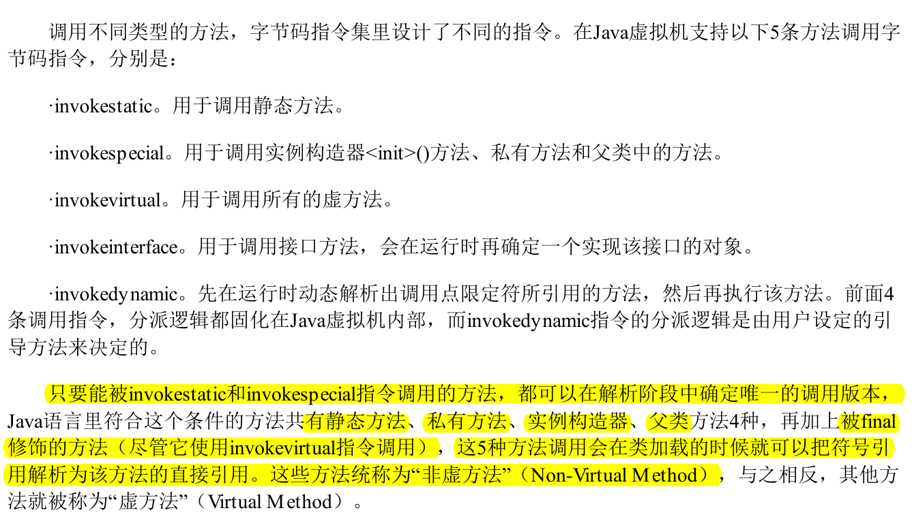

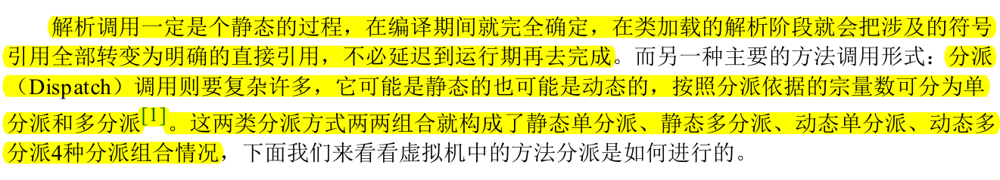

### 分派

#### 静态分派（重载实现）

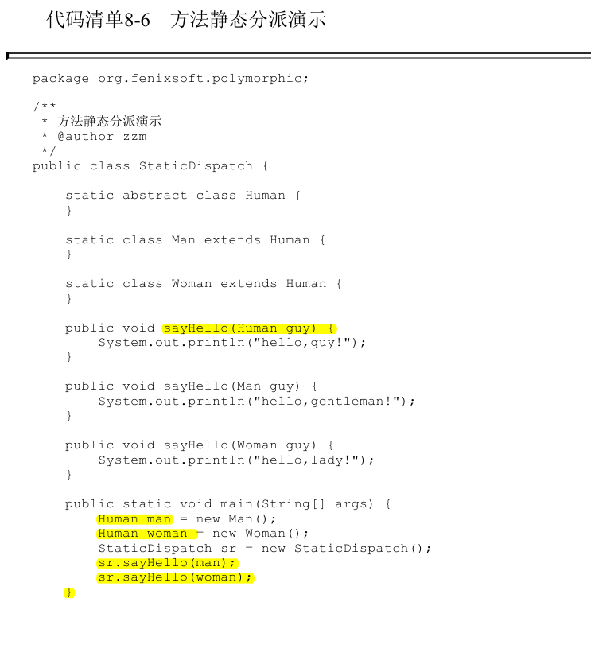

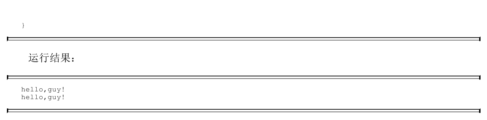

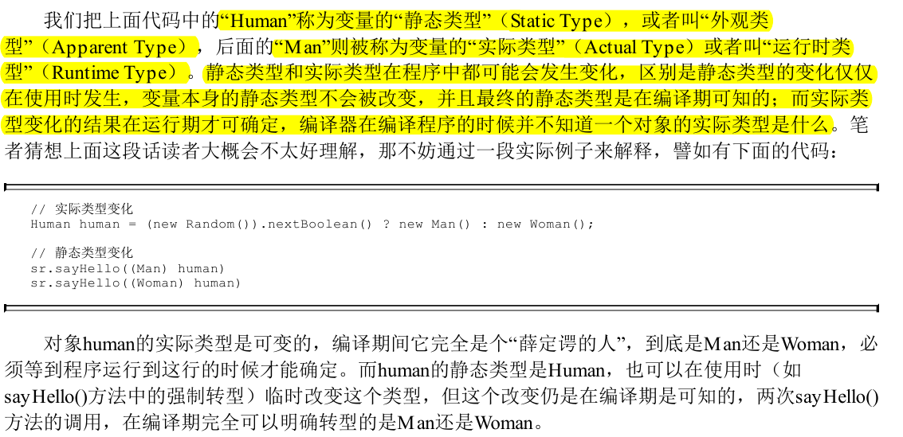

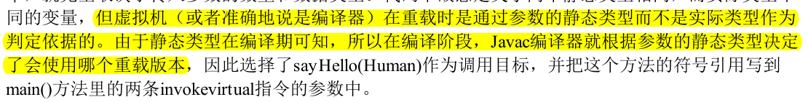

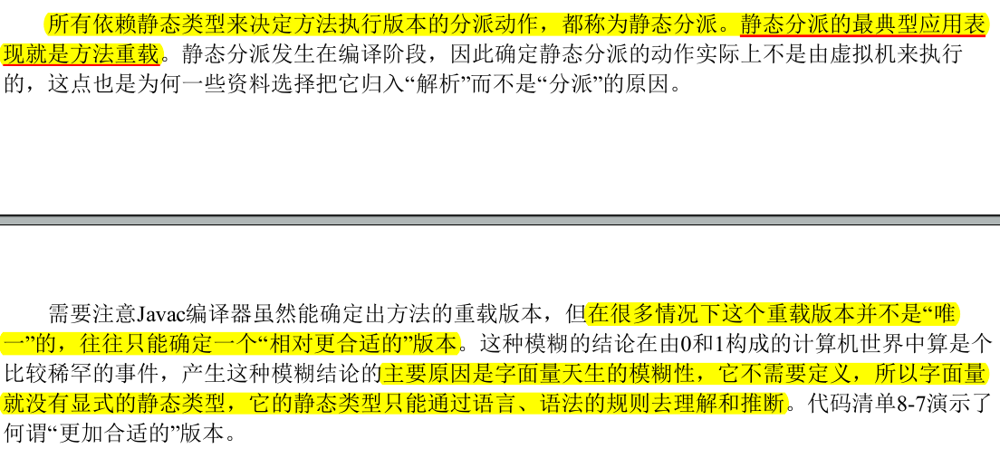

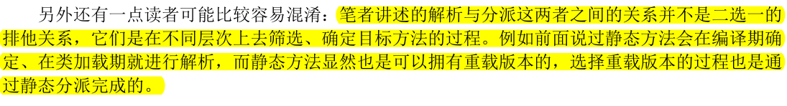

#### 动态分派（重写）

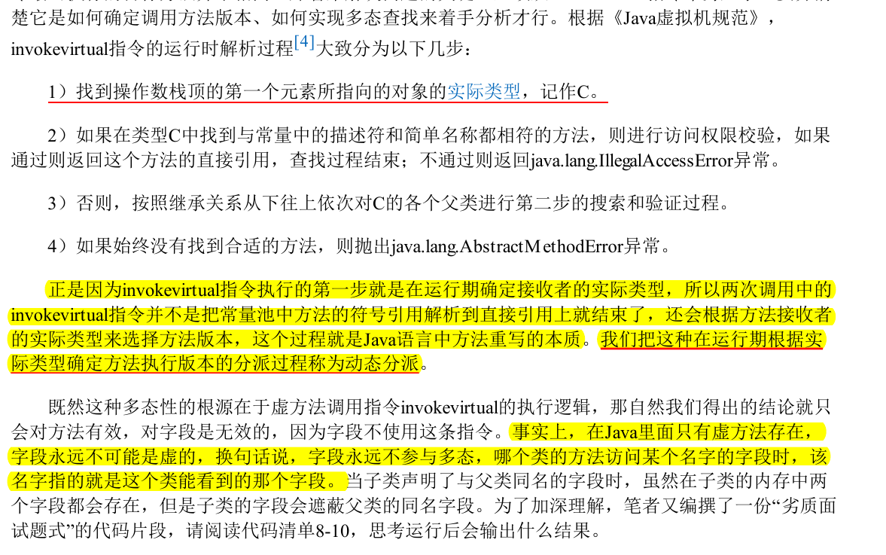

#### 单分派与多分派

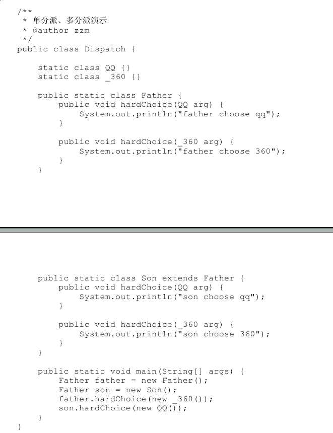

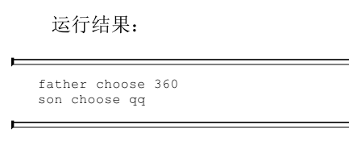

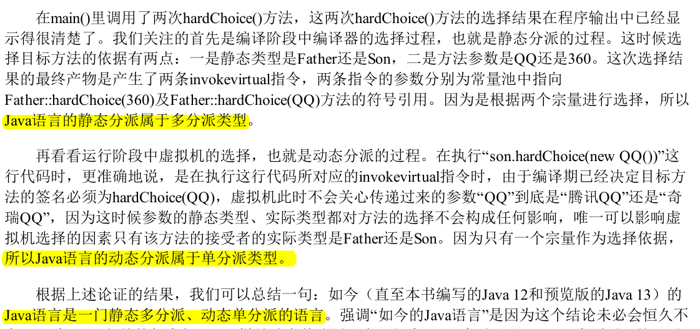

#### 虚拟机动态分派的实现

## 实战

### 如何在子类中调用父类的父类中的方法

